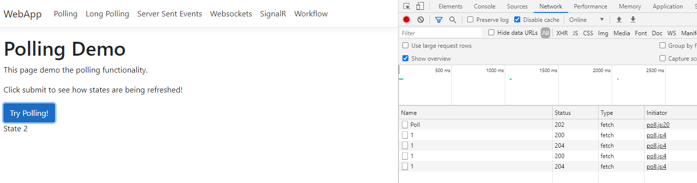
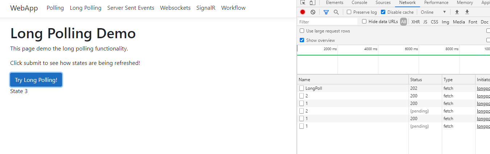
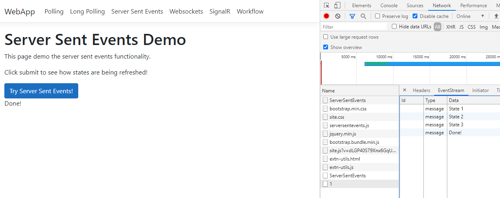
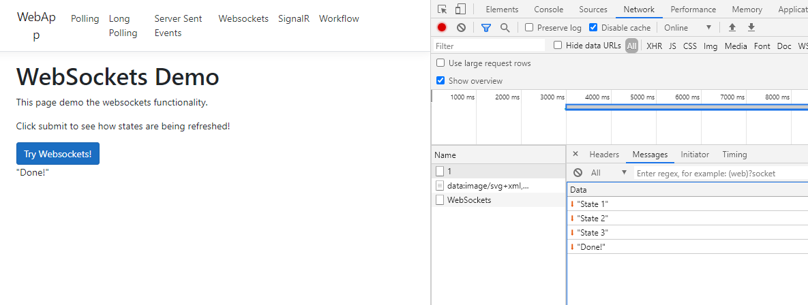
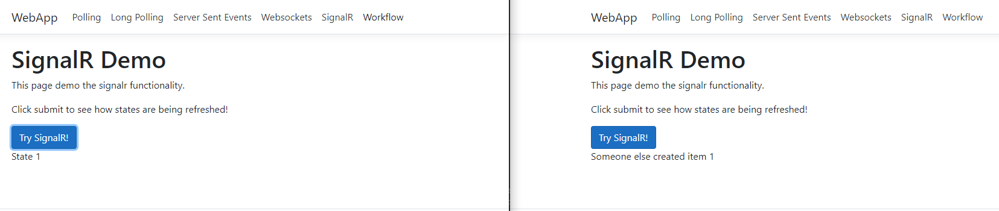
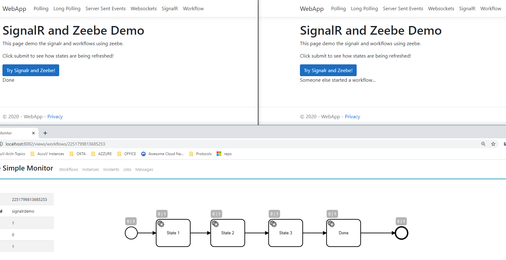

# Real Time Web 

[](https://app.circleci.com/pipelines/github/lucasledesma/SignalRDemo)

> :warning: **DISCLAIMER:** This code is only for demo purposes and should not be used as production code by any reason. Code structure is not following best practices. Also, it is not recommended to use plain javascript but a library (like i.e. react) instead, etc. Use it to learn, but nothing else.- :warning:

In this repository you can find different ways to get real time (or near real time) updates in the browser.

I demonstrate the following mechanisms:

* Polling
* Long Polling
* Server Sent Events
* Websockets 
* SignalR 

For the last case, SignalR, I also show how to create a DotNet Console Client. 

I also show how SignalR can be combined with a workflow engine, in this case Zeebe, to obtain real time notifications about the different steps of a workflow.

Projects in this repository

* [Web Application](WebApp)

* [Console Client](ConsoleClient)

* [Zeebe Client](ZeebeClient)

## Building

At the root of the project run the following command to build all the projects.

``` dotnet build```

The solution file SignalRDemo.sln contains all the subprojects.

## Running

At the root of the project you can run each project with these commands.

```
dotnet run --project Webapp

dotnet run --project ConsoleClient

dotnet run --project ZeebeClient
```

## Workflow

ZeebeClient project tries to connect to a Zeebe instance running in _http://localhost:26500_ . This is the default location for zeebe engine. To try this you can start zeebe and an instance of zeebe simple monitor as shown in the following location: _https://github.com/zeebe-io/zeebe-docker-compose_ 

The client will connect to the engine and deploy the demo workflow that is contained in the same project. Once deployed it will subscribe the handlers for the different workflow steps. The handlers just connect to the SignalRHub and notifies the workflow instance creator about updates.

## CI/CD

A ci/cd pipeline to automatically build these projects was created using [CircleCi](https://circleci.com/).

## Screenshots 

### Polling



### Long Polling



### Server Sent Events



### Web Sockets



### SingalR



### Workflow

